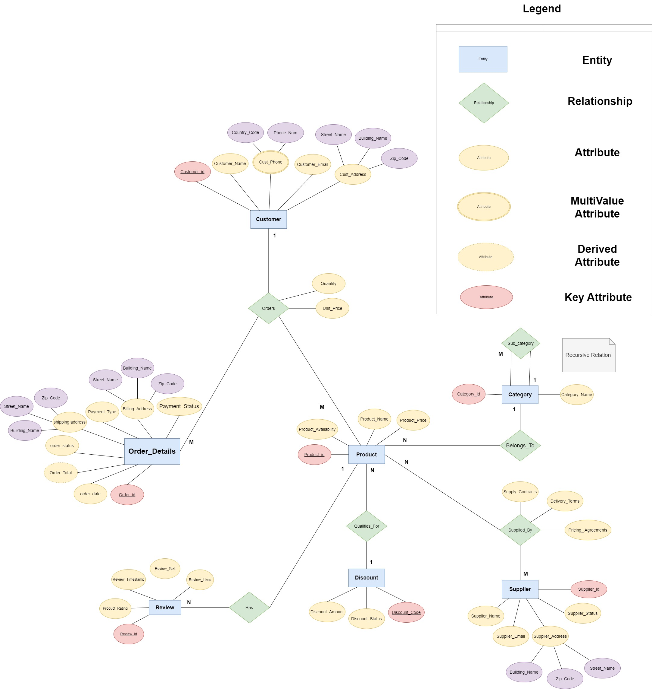

\newpage

```{r setup, include=FALSE}
knitr::opts_chunk$set(echo = TRUE,comment = NA)
library(readr)
```

**Load necessary libraries**

```{r}
library(DBI)
library(readr)
library(RSQLite)
library(dplyr)
library(stringr)
```

# Introduction 

This project simulates a real-world e-commerce data environment, including all stages of data management, from database configuration to data analysis and reporting. As the database is created and managed with SQLite, GitHub Actions are used to automate processes enhancing workflow efficiency. In addition, Quarto is used in conjunction with R to conduct comprehensive data analysis and generate reports. Through this approach, technical skills and competencies necessary for effective data management are examined in-depth, mirroring the complexities and dynamics encountered in e-commerce.  

# SQL Script

## Importing Generated Data

```{r}

con <- dbConnect(RSQLite::SQLite(), "ecommerce.db")
# on.exit(dbDisconnect(con), add = TRUE)

sql_file <- readLines("dbScript.sql")

for (sql_command in sql_file) {
  if (sql_command!=""){
    print(sql_command)
    dbExecute(con,sql_command)
    print("-------------DONE---------")
  }
}


```

```{r}

# con <- dbConnect(RSQLite::SQLite(), "ecommerce.db")
# 
# # con <- dbConnect(RSQLite::SQLite(), "ecommerce.db")
# 
# 
# Customers <- read_csv("Files/Customers.csv")
# 
# 
# Products <- read_csv("Files/Products.csv")
# 
# 
# Order_details <- read_csv("Files/Order_Details.csv",
#     skip = 1)
# 
# Reviews <- read_csv("Files/Reviews.csv",
#     skip = 1)
# 
# Suppliers <- read_csv("Files/Suppliers.csv")
# 
# 
# Product_Discounts <- read_csv("Files/Product_Discounts.csv")
# 
# 
# Product_Category <- read_csv("Files/Product_Category.csv")
# 
# 
# Order_Item <- read_csv("Files/Order_Item.csv", 
#     skip = 1)

```

## Category

```{r}
# To create empty column for the Products table 
# Products <- Products %>%
#   mutate(Category_ID = NA)
# 
# # To apply the foreign key into the table 
# # Define a function to assign Category_ID based on keywords in Product_Name
# assign_category_id <- function(Product_Name) {
#   if (grepl("TV|Television", Product_Name, ignore.case = TRUE)) {
#     return("CAT1")
#   } else if (grepl("Laptop|Tablet|Computing|Book|Surface|Monitor", Product_Name, ignore.case = TRUE)) {
#     return("CAT2")
#   } else if (grepl("Phone|Galaxy|Mi|P Series|OnePlus", Product_Name, ignore.case = TRUE)) {
#     return("CAT3")
#   } else if (grepl("Refrigerator|Washing Machine|Home Appliance|Microwave|Vacuum|Dishwasher", Product_Name, ignore.case = TRUE)){
#     return("CAT4")
#   } else if (grepl("Headphones|Speakers|Sound System|Earbuds|Speaker|Technica|Soundbar", Product_Name, ignore.case = TRUE)) {
#     return("CAT5")
#   } else if (grepl("Camera|Photography|GoPro|Mirrorless|Nikon|Camcorder|Compact", Product_Name, ignore.case = TRUE)) {
#     return("CAT6")
#   } else if (grepl("Xbox|PS|Gaming|Switch", Product_Name, ignore.case = TRUE)) {
#     return("CAT7")
#   } else if (grepl("Smart Home|Echo|Smart Lock|Steam Deck|Hue Light", Product_Name, ignore.case = TRUE)) {
#     return("CAT8")
#   } else if (grepl("Watch|Wearable|Quest|Tracker|Gear|Band|Glasses", Product_Name, ignore.case = TRUE)) {
#     return("CAT9")
#   } else if (grepl("Keyboard|Mouse|Peripheral|Thermostat", Product_Name, ignore.case = TRUE)) {
#     return("CAT10")
#   } else {
#     return(NA) # For products that do not match any category
#   }
# }
# 
# # Apply the function to assign Category_ID to each product
# Products$Category_ID <- sapply(Products$Product_Name, assign_category_id)
```

## Supplier

```{r}
# # This is to add suppliers_id in Products
# set.seed(123)
# 
# Products <- Products %>%
#   mutate(Supplier_ID = NA)
# 
# # Create a function to find matching supplier ID or assign randomly if no match is found
# assign_supplier_id <- function(Product_Name, Suppliers) {
#   for (i in 1:nrow(Suppliers)) {
#     if (str_detect(Product_Name, regex(Suppliers$Supplier_Name[i], ignore_case = TRUE))) {
#       return(Suppliers$Supplier_ID[i])
#     }
#   }
#   # If no match found, assign a random supplier ID
#   random_supplier_id <- sample(Suppliers$Supplier_ID, 1)
#   return(random_supplier_id)
# }
# 
# Products$Supplier_ID <- sapply(Products$Product_Name, function(x) assign_supplier_id(x, Suppliers))
# 
# # Adding Discount_Code column into Products 
# set.seed(123) # This is to ensure reproducibility
# 
# Products <- Products %>%
#   mutate(Discount_Code = NA)
# 
# codes_to_assign <- sample(1:nrow(Products), 50)
# 
# random_discounts <- sample(Product_Discounts$Discount_Code, 50)
# 
# Products$Discount_Code[codes_to_assign] <- random_discounts
```

## Review 

```{r}
# # Product_ID column for reviews table 
# set.seed(123)
# Reviews <- Reviews %>% 
#   mutate(Product_ID = sample(Products$Product_ID, nrow(Reviews), replace = TRUE))
```

## Order Details

```{r}
# # Adding Cust_ID column for Order_details table. 
# set.seed(123)
# Order_details <- Order_details %>%
#   mutate(Cust_ID = sample(Customers$Cust_ID, nrow(Order_details), replace = TRUE))
```

## Discount 

```{r}
# # Filter out the rows from Products that have a Disocunt_Code assigned 
# discounted_products <- Products %>%
#   filter(!is.na(Discount_Code)) %>%
#   select(Product_ID, Discount_Code)
# 
# # Do a left join to join it together 
# Product_Discounts <- Product_Discounts %>%
#   left_join(discounted_products, by = "Discount_Code")
# 
# # Same step for cat_id
# # Filter out the rows from Products that have a discount code assigned on the cat ID
# discounted_cat <- Products %>%
#   filter(!is.na(Category_ID)) %>%
#   select(Category_ID, Discount_Code)
# 
# # Do a left join to join it together, thus we get to see which discount code assign to which category of goods
# Product_Discounts <- Product_Discounts %>%
#   left_join(discounted_cat, by = "Discount_Code")
```

## Order Item

```{r}
# # Order_Items, product_ID
# set.seed(123)
# Order_Item <- Order_Item %>% 
#   mutate(Product_ID = NA)
# 
# # Assign first 150 unique Product_IDs to the first 150 rows
# Order_Item$Product_ID[1:150] <- sample(Products$Product_ID, size = 150, replace = FALSE)
# 
# # For the remaining 50 rows, randomly assign Product_IDs (allowing repeats)
# Order_Item$Product_ID[151:200] <- sample(Products$Product_ID, size = 50, replace = TRUE)
# 
# # Joining Order_Item with Products to get the Price for each Product_ID
# Order_Item <- merge(Order_Item, Products[, c("Product_ID", "Product_Price")], by = "Product_ID", all.x = TRUE)
# 
# Order_Item <- Order_Item %>% rename(Quantity = Order_Item)
# # Calculating Sum_Price as Price * Quantity
# Order_Item <- Order_Item %>%
#   mutate(Sum_Price = Product_Price * Quantity)
# 
# # Remove the Product_Price column 
# Order_Item$Product_Price <- NULL
```

```{r}

# set.seed(123)
# Order_Item <- Order_Item %>%
#   mutate(Order_ID = NA)
# 
# # Assign first 150 unique Order_IDs to the first 150 rows
# Order_Item$Order_ID[1:150] <- sample(Order_details$Order_ID, size = 150, replace = FALSE)
# 
# # Function to assign unique Order_IDs avoiding duplicates for each Product_ID, it intended to assign unique order id to each row in order_item in a way that avoids assigning the same Order_ID to the same Product_ID more than once
# assign_unique_order_ids_full_range <- function(order_item, order_details) {
#   # Get all unique Order_IDs from Order_Details
#   all_order_ids <- unique(Order_details$Order_ID)
#   
#   # Iterate over each row in order_item
#   for (i in 151:nrow(Order_Item)) { # The first 150 are pre-assigned
#     product_id <- Order_Item$Product_ID[i]
#     
#     # Find Order_IDs used by the same Product_ID
#     used_order_ids <- Order_Item$Order_ID[Order_Item$Product_ID == product_id]
#     
#     # Available Order_IDs are those not yet used by this Product_ID
#     available_order_ids <- setdiff(all_order_ids, used_order_ids)
#     
#     if (length(available_order_ids) == 0) {
#       stop("Ran out of unique Order_IDs to assign for Product_ID: ", product_id)
#     }
#     
#     # Randomly select an available Order_ID for the Product_ID
#     Order_Item$Order_ID[i] <- sample(available_order_ids, 1)
#   }
#   
#   return(Order_Item)
# }
# 
# <!-- # To apply this function: -->
# Order_Item <- assign_unique_order_ids_full_range(Order_Item, Order_details)


# Disconnect
# dbDisconnect(con)
```

# Database Design and Implementation

## Entity Relationship Diagram



The E-R diagram above simulates a real-world e-commerce data ecosystem, capturing the detailed relationships between entities and attributes essential for facilitating online transactions. In addition, it provides a comprehensive view of the e-commerce system, which serves as a platform for users to browse products, make purchases, and securely complete their payments.

### Assumptions

-   The company only distributes products within the United Kingdom (UK).

-   The Currency used is Pound Sterling (GBP).

-   Attributes formats will be aligned with UK standard formats such as date , addresses , names ...etc

### Entities and Attributes

This section describes and illustrates the entities in the above ERD and their respective attributes.

#### Customer 

Shows us the users who previously have at least once purchased products and placed an order including information about their names , emails, and addresses.

#### Supplier 

Vendors who provide products. Represent the source of the product items.

#### Product 

Describes all products in the stock and available for sale. Provides information about the model, price, and availability of the products.

#### Order_Details

Emphasises all details related to placed orders including billing, shipping address, order, payment status, order date, and payment type.

#### Category and Sub-Category

Category is the broad classification of products that share common features or are  intended for a similar purpose. A sub-category is a more specific grouping of products within a category based on finer distinctions or attributes. 

Sub-categories fall under a primary category and help to further organize products into narrower groups, making the product search process even more straightforward for customers.


#### Product_Discounts 

The voucher number or offer code to be applied to eligible products. The amount of discount it offers as well as the status of the discount are the main attributes.

#### Reviews 

Contains Written comments and rating of product sold by verified buyers, the likes of the top reviews as well as the time stamp of when the review was made.

## Design Considerations

### Absence of an Order Entity

- The model intentionally skips direct order management. Instead, it focuses on product management and customer interactions through reviews and payment methods.Additionally, This consideration will guarantee that products purchased by customers are not tracked or stored by the system to align with privacy policies.

-   Order Entity not considered in this ER design in order to follow best practices by not having to include orderId as part of product table which might affect the overall performance of DB retrieval.

-   Customer Engagement: By including Reviews, the model emphasizes customer engagement and feedback without directly managing transactions.

-   Payment Information: Including Payment_Method without an Order entity suggests a pre-registration of payment preferences or a simplified wallet storage that could be expanded in the future.

## Relationships and Cardinalities 

### Customer Orders Products

A Customer initiates an Order when they purchase products or services. It is considered for customer management, processing transactions, and tracking order history. One customer can place multiple orders over time, each uniquely associated with one customer.

**Associative Attributes**: (Quantity: The number of units of the product ordered in this line item.), (Unit Price: The price per unit of the product at the time of the order. This is important as product prices can vary over time), (Unit_Sub_Total : The total cost for this line item (typically calculated as (Quantity * Unit Price)).

### Customer Has Order Status

This relation will be created when customers order their first product or service. They will be linked with a particular Order Status indicating what they ordered, reflecting the current state or progression throughout the process. One customer can be associated with multiple order statuses at any given time. Moreover, it is good for tracking an order's life cycle, allowing for updates, customer notifications, and management of the order fulfilment process.

### Product Belongs to Category

Each Product is classified under a specific Category where products can belong to multiple categories e.g., a product that fits into both "Electronics" and "Gadgets". This enabling customer to browse products by categories, and helping retailers to manage product listings more efficiently.

### Category Self-Reference Relation 

A category can have multiple subcategories, creating a hierarchically nested structure and making it easier for users to navigate the product catalogue. For example, the "Phones" category might have "Apple” and "Samsung" as subcategories, which in turn could have their own subcategories of different phone models.

### Product Supplied_By Supplier

The relationship creates a link between the products and their suppliers. Thereby indicating multiple vendors can supply a product, as well as supply multiple different products. The relation helps track inventory sources, manage supplier relationships, and ensure product availability.

### Product Qualifies_For Discount

The relation signifying that the product is eligible for certain promotional discount enabling dynamic pricing strategies, encouraging sales, and providing customers with various savings opportunities on different products. In this context and for simplicity the relation representing one discount code or voucher that is valid to apply on multiple eligible products.

### Customer Writes a Review

A customer generates or provides reviews that reflect the action of providing feedback or evaluation for a product or service to improve product offerings and customer service. One customer can write or submit multiple reviews for different products or services over time. However, each review is uniquely associated with one customer.


## Logical Schema

### Customers 

Customers ($\underline{Customer_id}$, Customer_Email, Cust_F_Name, Cust_L_Name, Phone_Country_Code, Phone_Num, Cust_Street_Name, Cust_Building_Name, Cust_Zip_Code)

### Products 

Products ($\underline{Product_id}$, *Discount_Code*, *Category_id*, Product_Name, Product_Price, Product_Availability)

### Suppliers

Suppliers ($\underline{Supplier_id}$, Supplier_Email, Supplier_Name, Supplier_Status, Sup_Building_Name, Sup_Street_Name, Sup_Zip_Code)

### Order_Details

Order_Details ($\underline{Order_id}$, *Customer_id*, Order_Date, Order_Total, Order_Status, S_Building_Name, S_Street_Name, S_Zip_Code, Street_Name, B_Building_Name, B_Street_Name, B_Zip_Code, Payment_Type, Payment_Status)

### Discounts

Discounts ($\underline{Discount_Code}$, Discount_Status, Discount_Amount)

### Reviews

Reviews ($\underline{Review_id}$, *Product_id*, Review_Rating, Review_Timestamp, Review_Text, Review_Likes)

### Categories

Categories ($\underline{Category_id}$, Category_Name)

### SupplierProduct

SupplierProduct ($\underline{Supplier_id, Product_id}$, Supply_Contracts, Delivery_Terms, Pricing_Agreements)

### Many To Many : Supplier - Product

SupplierProduct ($\underline{Supplier_id,Product_id}$)

### Many to Many : Order_details - Product

ProductOrder_details ($\underline{Order_id, Product_id}$, Quantity, Unit_Price)


# Part 2: Data Generation and Management

## Synthetic Data Generation 

After the agreement on the schema mentioned in the previous section, the team started to generate synthetic data that to some extent, imitated realistic e-commerce as much as possible.

ChatGPT has been used as the main tool for this step as an alternative to Mockaroo, as the former produces more structural and logical data than the latter. 

## Data Import and Quality Assurance

The process was done manually to the very few cells that still don’t make any sense related to e commerce, or it was left blank and AI tools missed to produce. 


# Part 3: Data Pipeline Generation


```{r}
# We need to rename and delete columns like building number, as it does not match or does not exist in the database 
# Suppliers amendment 
# Suppliers$Supplier_Building_Number <- NULL
# Suppliers <- Suppliers %>% rename(Supplier_Zip = Supplier_Zip_Code)

# Customers amendment 
# Customers <- Customers %>% rename(Cust_Zip = Cust_Zip_Code)
# Customers <- Customers %>% rename(Cust_Country_Code = Phone_Country_Code)


# Order_details 
# Don't have these in the database 
# Order_details$Billing_Building_Number <- NULL
# Order_details$Shipping_Building_Number <- NULL

#This is one of the ways of doing it , havent do order_details pending for changes from abigail. 
# RSQLite::dbWriteTable(con, "Category", Product_Category, overwrite=TRUE)
# RSQLite::dbWriteTable(con, "Suppliers", Suppliers, overwrite=TRUE)
# RSQLite::dbWriteTable(con, "Discounts", Product_Discounts, overwrite=TRUE)
# 
# 
# RSQLite::dbWriteTable(con, "Reviews", Reviews, overwrite=TRUE) 
# RSQLite::dbWriteTable(con, "Order_Items", Order_Item, overwrite=TRUE)
# RSQLite::dbWriteTable(con, "Order_Details", Order_details, overwrite=TRUE)
```

### Count the number of reviews for each rating level
```{sql connection=con}

SELECT Product_Rating, COUNT(Product_Rating) AS Product_Rating_Count
FROM Reviews
GROUP BY Product_Rating;

```

**Display all products supplied by S001 (i.e. Apple) in descending price**

```{sql connection=con}

SELECT *
FROM Products 
WHERE Supplier_ID = "S001"
ORDER BY Product_Price DESC;

```

**Top 5 Orders with the highest total value after discount**

<<<<<<< HEAD
=======

### Top 5 Orders with the highest total value after discount
>>>>>>> f1bbda312232a4a5ce8be5ee6fd7155f7ad48d03
```{sql connection=con}

SELECT a.Order_ID, a.Quantity, a.Sum_Price, b.Discount_Amount, ROUND(a.Quantity * a.Sum_Price - b.Discount_Amount) AS Total_Value
FROM Order_Items a, Discounts b
WHERE a.Product_ID = b.Product_ID
ORDER BY Total_Value DESC
LIMIT 5;

<<<<<<< HEAD
```

# Conclusion

Upon completion of this project, valuable insights are gained regarding the challenges and methodologies associated with an e-commerce context, including the design of databases, analysis of data, and presentation of findings in a clear and impactful manner. Ultimately, this project serves as a reference for future e-commerce projects in particular and data-driven projects in general, providing valuable insight into the modern data management landscape.
=======
# Disconnect
dbDisconnect(con)

```

>>>>>>> f1bbda312232a4a5ce8be5ee6fd7155f7ad48d03
