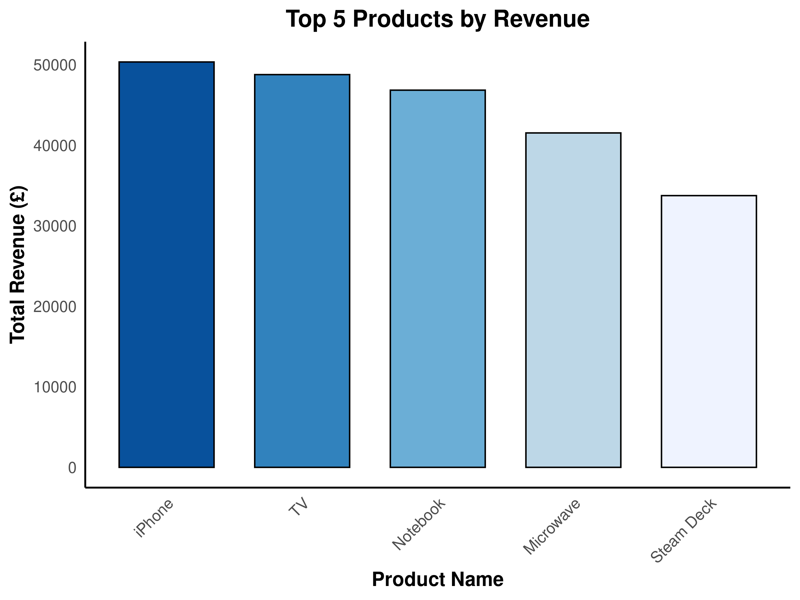

\newpage

```{r setup, include=FALSE}
knitr::opts_chunk$set(echo = TRUE,comment = NA)
library(readr)
```

**Load Necessary Libraries**

```{r Libraries, echo=TRUE, results='hide' , message=FALSE, warning=FALSE}
library(DBI)
library(readr)
library(RSQLite)
library(dplyr)
library(stringr)
```

# Introduction 

<p> This project simulates a real-world e-commerce data environment, including all stages of data management, from database configuration to data analysis and reporting. The database is created and managed with SQLite while GitHub Actions are used to automate processes enhancing workflow efficiency. In addition, Quarto is used in conjunction with R to conduct comprehensive data analysis and generate reports. Through this approach, technical skills and competencies necessary for effective data management are examined in-depth, mirroring the complexities and dynamics encountered in e-commerce.</p>

# Database Design and Implementation

## Entity Relationship Diagram


<p> **Figure 1** shows the E-R diagram that simulates a real-world e-commerce data ecosystem, capturing the detailed relationships between entities and attributes essential for facilitating online transactions. In addition, it provides a comprehensive view of the e-commerce system, which serves as a platform for users to browse products, make purchases, and securely complete their payments. </p>

### Assumptions

-   The company only distributes products within the United Kingdom (UK).

-   The Currency used is Pound Sterling (GBP).

-   Attributes formats will be aligned with UK standard formats such as date , addresses , names ...etc

### Entities and Attributes

This section describes and illustrates the entities in the above ERD and their respective attributes.

- Customer 

&nbsp;&nbsp;&nbsp;&nbsp;Shows us the users who previously have at least once purchased products and placed an order. Its attributes including names , emails, phone numbers , and addresses.

- Supplier 

&nbsp;&nbsp;&nbsp;&nbsp;Vendors who provide products. Represent the source of the product items.The entity store contains attributes of names , addresses, emails, and status that indicates Whether the supplier is currently supplying items or not (Active/Inactive).

- Product 

&nbsp;&nbsp;&nbsp;&nbsp;Describes all products in the stock and available for sale.Its attributes are name, price, and availability of the products.

- Order Details

&nbsp;&nbsp;&nbsp;&nbsp;Emphasises all details related to placed orders. Some of its attributes including order total , billing and shipping addresses, type and status of payment , date and status of the order. 

- Category and Sub-Category

&nbsp;&nbsp;&nbsp;&nbsp;Category is the broad classification of products that share common features or are  intended for a similar purpose. A sub-category is a more specific grouping of products within a category based on finer distinctions or attributes. 

&nbsp;&nbsp;&nbsp;&nbsp;Sub-categories fall under a primary category and help to further organise products into narrower groups, making the product search process even more straightforward for customers. 


- Product Discounts 

&nbsp;&nbsp;&nbsp;&nbsp;The voucher number or offer code to be applied to eligible products. The amount of discount it offers as well as the status of the discount are the main attributes.

- Reviews 

&nbsp;&nbsp;&nbsp;&nbsp;Contains Written comments and rating of product sold by verified buyers, the likes of the top reviews as well as the time stamp of when the review was made.


## Design Considerations

### Absence of an Order Entity

<p> The model intentionally skips direct order management. Instead, it focuses on product management and customer interactions through reviews and payment methods. Additionally, This consideration will guarantee that products purchased by customers are not tracked or stored by the system to align with privacy policies.</P>

<p> Order Entity not considered in this ER design in order to follow best practices by not having to include orderId as part of product table which might affect the overall performance of DB retrieval.</p>

<p> Including Payment methods without an Order entity suggests a pre-registration of payment preferences or a simplified wallet storage that could be expanded in the future.</p>

## Relationships and Cardinalities 

### Order Detail Contains Products 

<p> This relation as can be seen in **Figure 2** indicates that each order detail contains multiple products that have been placed by the customer. It aids to track the date , status , addresses, and payment method used in the transaction.</p>

<p> {width=400px height=400px} </p>

**Associative Attribute** (Quantity: The number of units of the product ordered in this line item.)

### Customer Has Order Details

<p> This relation will be created when customers order their first product or service. They will be linked with a particular order detail indicating what they ordered, reflecting the current state or progression throughout the process. One customer can be associated with multiple order details at any given time as illustrated in **Figure 3**. Moreover, it is good for tracking an order's life cycle, allowing for updates, customer notifications, and management of the order fulfillment process.</p>


<p> {width=400px height=400px} </p>

### Product Belongs to Category

**Figure 4** specify that each product is classified under a specific Category where products can belong to only one category. This enables customers to browse products by category and helps retailers manage product listings more efficiently.


<p> {width=400px height=400px} </p>

### Category Self-Reference Relation 

<p> As reflected in **Figure 5**, category can have multiple subcategories, creating a hierarchically nested structure and making it easier for users to navigate the product catalogue. For example, "Home Appliances" is the parent category contains subcategories like Washing Machines , Food Processors, Dishwashers etc.</p>


<p> {width=400px height=400px} </p>

### Product Supplied By Supplier

<p> This relation is important for inventory management, reflecting the real-world scenario where a single supplier might provide various products, but each product is supplied by only one specific supplier **Figure 6**. It is essential to understand how products are sourced in a database model, where tracking the source of each product is crucial. The relation helps track inventory sources, manage supplier relationships, and ensure product availability.</p>

<p> {width=400px height=400px} </p>

**Associative Attributes : ** 

- Supply_Contracts : Legal agreements that outline the terms and conditions under which one party will provide goods or services to another.

- Delivery_Terms : Agreements that specify the price, or method for determining the price, at which goods or services will be sold or provided.

- Pricing_ Agreements : Conditions in a contract that define the responsibilities, costs, and risk transfer points related to the transportation of goods from the seller to the buyer.


### Product Qualifies For Discount

<p> The relation signifying that the product is eligible for certain promotional discount enabling dynamic pricing strategies, encouraging sales, and providing customers with various savings opportunities on different products. In this context and for simplicity the relation representing one discount code or voucher that is valid to apply on multiple eligible products **Figure 7**.</p>

<p> {width=400px height=400px} </p> 

### Product Has Reviews

A product’s reviews are generated or provided by Customers reflecting the action of providing feedback or evaluation for a specific product or service to improve product offerings and customer service. However, one product can have multiple reviews over time as shown in **Figure 8**.

<p> {width=400px height=400px} </p> 


## Logical Schema

Legend$\footnote{Italic attributes indicate foreign keys}$

### Customers 

Customers ($\underline{\text{Cust\_ID}}$, Cust_First_Name, Cust_Last_Name, Cust_Building_Name, Cust_Street_Name, Cust_Zip_Code, Cust_Email, Cust_Phone_Number, Cust_Country_Code)

### Products 

Products ($\underline{\text{Product\_ID}}$, *Discount_Code*, *Category_ID*, *Supplier_ID* ,Product_Name, Product_Availability, Product_Price)

### Suppliers

Suppliers ($\underline{\text{Supplier\_ID}}$, Supplier_Name, Supplier_Building_Name, Supplier_Street_Name, Supplier_Zip_Code, Supplier_Email, Supplier_Status)

### Order_Details

Order_Details ($\underline{\text{Order\_ID}}$, *Customer_ID*, *Discount_Code*, Order_Date, Shipping_Building_Name, Shipping_Street_Name, Shipping_Zip_Code, Order_Total, Order_Status, Payment_Type, Payment_Status, Billing_Building_Name, Billing_Street_Name, Billing_Zip_Code)

### Discounts

Discounts ($\underline{\text{Discount\_Code}}$, *Category_ID*, *Product_ID*, Discount_Amount, Discount_Status)

### Reviews

Reviews ($\underline{\text{Review\_ID}}$, *Product_ID*, Review_Timestamp, Product_Rating, Review_Text, Review_Likes)

### Categories

Categories ($\underline{\text{Category\_ID}}$, *Sub_Cat_ID*, Category_Name)


### Many to Many : Order_details - Product

Order_Items ($\underline{\text{Order\_ID, Product\_ID}}$, Quantity)

## Physical Schema Creation 

```{r echo=TRUE, results='hide' , message=FALSE, warning=FALSE}
#Creating the db schema in SQL
con <- dbConnect(RSQLite::SQLite(), "ecommerce.db")
sql_file <- readLines("dbScript.sql")
for (sql_command in sql_file) {
  if (sql_command!=""){
    print(sql_command)
    dbExecute(con,sql_command)
    print("-------------DONE---------")
  }
}
```

## Normalisation

<p> The First Normal Form (1NF) mandates atomic values and unique rows via a primary key without duplicate columns. The tables were verified to meet these criteria. For Second Normal Form (2NF), achieved when a table in 1NF has all non-key attributes fully dependent on the primary key, thus avoiding partial dependencies on composite keys. Finally, the Third Normal Form (3NF) is met when there are no transitive dependencies, with all attributes fully dependent on the primary key. The team conducted thorough checks to ensure all tables comply with 3NF requirements, as detailed in subsequent sections.</p>

### Customers:

Looking at the table, we can identify the following dependencies:

Cust_ID	→ Cust_First_Name \newline Cust_ID	→ Cust_Last_Name \newline Cust_ID → Cust_Building_Number \newline Cust_ID	→ Cust_Building_Name \newline Cust_ID	→ Cust_Street_Name \newline Cust_ID	→ Cust_Country_Code	\newline Cust_ID	→ Cust_Email \newline Cust_ID	→ Cust_Phone_Number	

- Based on this analysis, the table appears to be in 3NF. Each non-key attribute depends only on the primary key (Cust_ID), and there are no transitive dependencies.

### Order_items:

Product_ID , Order_ID → Order_Items 

Product_ID and Order_ID combined are representing composite key, and Quantity is functionally dependent on Product_ID and Order_ID. There are no transitive dependencies here.

All non-prime attributes are fully functionally dependent on the primary key.

### Order_details:

Order_ID → Order_Date \newline Order_ID → Order_Status \newline Order_ID → Payment_Type \newline Order_ID → Payment_Status \newline Order_ID → Cust_ID \newline Order_ID → Shipping_Building_Name \newline Order_ID → Shipping_Street_Name \newline Order_ID → Shipping_Zip_Code \newline Order_ID → Billing_Building_Name \newline Order_ID → Billing_Street_Name \newline Order_ID → Billing_Zip_Code

<p> Given that Cust_ID is a foreign key in this table and that there is a separate Customers table where Cust_ID serves as the primary key, it suggests that Cust_ID is not functionally dependent on any other attribute within this table. It is merely referencing the primary key of another table.</p>

<p> Therefore, the dependency involving Cust_ID does not violate 3rd Normal Form (3NF). The table appears to be in 3NF as long as all other attributes are functionally dependent on the primary key (Order_ID) and not on any non-key attributes.</p>

### Product Category

Category_ID → Category_Name \newline Category_ID → Sub_Cat_ID

Category_ID is the primary key and it uniquely identifies Category_Name.

### Product Discount

Discount_Code → Discount_Amount	\newline Discount_Code → Discount_Status

Analyzing the functional dependencies, it is found that Discount_Code is the primary key and it uniquely identifies Discount_Amount and Discount_Status. 

Each Discount_Code corresponds to a specific Discount_Amount and Discount_Status, ensuring that the table adheres to the principles of 3rd Normal Form (3NF). There are also no transitive dependencies or non-key attributes determining other attributes within the table.

### Products

Product_ID → Product_Name	\newline Product_ID → Product_Price	\newline Product_ID → Product_Availability

The table also contains foreign keys, namely Supplier_ID, Discount_Code, and Category_ID. These foreign keys are fully functionally dependent on the primary key and not on any other non-key attributes.

Examining the attributes' functional dependencies, Product_ID emerges as the primary key, in which Product_Name, Product_Price and Product_Availability appears to be functionally dependent on it.

### Reviews

Review_ID → Review_Timestamp \newline Review_ID → Product_Rating \newline Review_ID → Review_Text \newline Review_ID → Review_Likes

In the Reviews table, Review_ID acts as the primary key, ensuring uniqueness. Attributes like Review_Timestamp, Product_Rating, Review_Text and Review_Likes are dependent on Review_ID. 

### Suppliers

Supplier_ID → Supplier_Name	\newline Supplier_ID → Supplier_Building_Name \newline Supplier_ID → Supplier_Building_Number \newline Supplier_ID → Supplier_Street_Name \newline Supplier_ID → Supplier_Zip_Code	\newline Supplier_ID → Supplier_Email	\newline
Supplier_ID → Supplier_Status

In the Suppliers table, Supplier_ID acts as the primary key. Attributes such as Supplier_Name,	Supplier_Building_Name,	Supplier_Building_Number,	Supplier_Street_Name,	Supplier_Zip_Code,	Supplier_Email and	Supplier_Status are dependent on Supplier_ID.

<p> Given these functional dependencies where each attribute seems to be functionally dependent on the primary key, with no non-key attributes determining other, all tables appears to adhere to the principles of 3rd Normal Form (3NF).</p> 


# Part 2: Data Generation and Management

## Synthetic Data Generation 

After the agreement on the schema mentioned in the previous section, the team started to generate synthetic data that to some extent, imitated realistic e-commerce as much as possible.

ChatGPT has been used as the main tool for this step as an alternative to Mockaroo, as the former produces more structural and logical data than the latter. **[Appendix 1,2]**. For tables consisting of foreign keys, R code has been used for assignment based of logic set by the team **[Appendix 3]**.

## Data Import and Quality Assurance

To enhance data quality for e-commerce analysis and validate the csv data generated, we use R to perform 4 main checks **[Refer data_validate.R]**:

- Primary key integrity check
- Duplicate entry check
- Email id pattern check
- Phone number pattern check

<p> {width=300px height=300px} </p>

<p> Once the data has gone through all the checks, the updated csv files will be used to import into SQL. Importing the data into SQL is also done in R **[Refer data_update.R]**. This method focused on refining datasets for accurate analysis by identifying and eliminating invalid entries and duplicates, thereby maintaining the dataset's uniqueness and reliability before inserting into Data Base.</p>


# Part 3: Data Pipeline Generation

To efficiently collaborate on this assignment, we have uploaded the project to Github. This was done so that the team could track changes, follow progress, collaborate on bug fixes etc. Moving the project to Github also allowed for implementation of version control and continuous integration.

## Github Repository Creation

<p>The pipeline generation process consists of two phases. In the first phase, github repository has been created$^{[1]}$ followed by integrating the posit cloud project. Additionally, all teams members have been added as collaborators.</p> 
 
## Automated Workflow 
 
<p>Second phase was the automating our workflow. Using Github Workflows, we were able to automate the process of validating data, updating data and data analysis. The workflow is triggered on pushing new data to the project. Once all 3 steps are completed successfully, the new files are committed and pushed to the project.</p>

<p> **Figures 10, 11** shows the updated analysis after 1st run of workflow (49) and then after second run of workflow (150).</p>

<p> {width=450px height=450px} </p>

<p> {width=450px height=450px} </P>

**Figure 12** illustrate console output showing the record count in the sql database after data update using the workflow.

<p> {width=450px height=450px} </p>

<p> In **Figure 13** the snippet is Timestamps that showed as an evidence of a working workflow </p>

<p> {width=450px height=450px} </p>


# Part 4: Data Analysis and Reporting with Quarto in R

<p> {width=450px height=450px} </p>

<p> Information regarding product ratings, sales revenue, customer distribution, and order status was obtained through the establishment of a connection to an SQLite database and the execution of SQL queries. Subsequently, data visualisation techniques were used to identify the distribution and patterns within the data, offering insights into e-commerce operational dimensions.</p>

<p> The graph in **Figure 14** shows the distribution of product ratings from 0 to 5 coloured by category name. </p>

<p> {width=450px height=450px} </p>

<p> **Figure 15** reflecting Top 5 Products Sorted by total Revenue.</p>


<p> After joining the "Order_Items", "Discounts", and “Products” tables, the derived value, which is the “Total Revenue”, is calculated by multiplying “Order_Item” quantity and “Product_Price” and deducting it with “Discount_Amount.</p>

<p> {width=400px height=400px} </p>

<p> The graph in **Figure 16**  shows the distribution of customers by phone country codes.</p>
 

<p> **Figure 17** displays the order status count of shipped, processing, delivered and cancelled orders. </p>

<p> {width=400px height=400px} </p>


# Conclusion

Upon completion of this project, valuable insights are gained regarding the challenges and methodologies associated with an e-commerce context, including the design of databases, analysis of data, and presentation of findings in a clear and impactful manner. Ultimately, this project serves as a reference for future e-commerce projects in particular and data-driven projects in general, providing valuable insight into the modern data management landscape.

# References 

1. To be redirected to the project repository click [here](https://github.com/abigail-g/E-commerceDB)

# Appendices 

## Appendix 1

<p> {width=400px height=400px} </p>

## Appendix 2

<p> {width=450px height=450px} </p>

## Appendix 3

<p></p>
