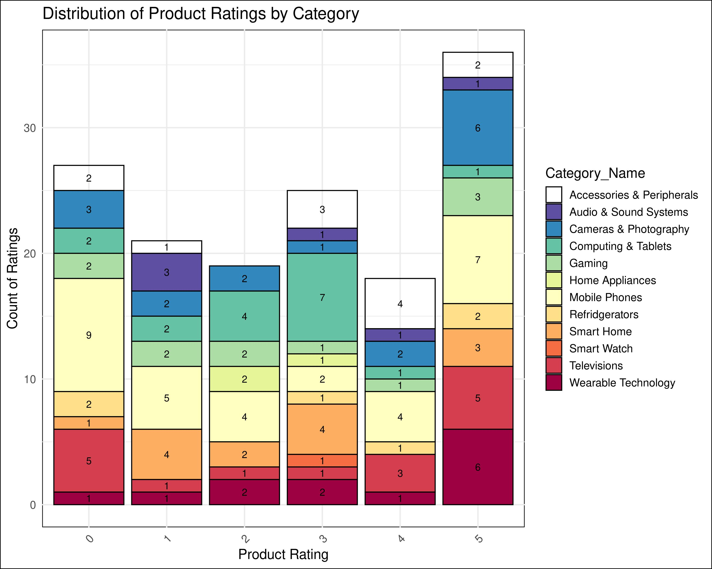

\newpage

```{r setup, include=FALSE}
knitr::opts_chunk$set(echo = TRUE,comment = NA)
library(readr)
```

**Load necessary libraries**

```{r}
library(DBI)
library(readr)
library(RSQLite)
library(dplyr)
library(stringr)
```

# Introduction 

This project simulates a real-world e-commerce data environment, including all stages of data management, from database configuration to data analysis and reporting. As the database is created and managed with SQLite, GitHub Actions are used to automate processes enhancing workflow efficiency. In addition, Quarto is used in conjunction with R to conduct comprehensive data analysis and generate reports. Through this approach, technical skills and competencies necessary for effective data management are examined in-depth, mirroring the complexities and dynamics encountered in e-commerce.  

# Database Design and Implementation

## Entity Relationship Diagram


The E-R diagram above simulates a real-world e-commerce data ecosystem, capturing the detailed relationships between entities and attributes essential for facilitating online transactions. In addition, it provides a comprehensive view of the e-commerce system, which serves as a platform for users to browse products, make purchases, and securely complete their payments.

### Assumptions

-   The company only distributes products within the United Kingdom (UK).

-   The Currency used is Pound Sterling (GBP).

-   Attributes formats will be aligned with UK standard formats such as date , addresses , names ...etc

### Entities and Attributes

This section describes and illustrates the entities in the above ERD and their respective attributes.

#### Customer 

Shows us the users who previously have at least once purchased products and placed an order including information about their names , emails, and addresses.

#### Supplier 

Vendors who provide products. Represent the source of the product items.The entity store information about their names , addresses, emails, and status that indicates Whether the supplier is currently supplying items or not (Active/Inactive).

#### Product 

Describes all products in the stock and available for sale. Provides information about the model, price, and availability of the products.

#### Order_Details

Emphasises all details related to placed orders including billing, shipping address, order, payment status, order date, and payment type.

#### Category and Sub-Category

Category is the broad classification of products that share common features or are  intended for a similar purpose. A sub-category is a more specific grouping of products within a category based on finer distinctions or attributes. 

Sub-categories fall under a primary category and help to further organize products into narrower groups, making the product search process even more straightforward for customers.


#### Product_Discounts 

The voucher number or offer code to be applied to eligible products. The amount of discount it offers as well as the status of the discount are the main attributes.

#### Reviews 

Contains Written comments and rating of product sold by verified buyers, the likes of the top reviews as well as the time stamp of when the review was made.

## Design Considerations

### Absence of an Order Entity

<p> The model intentionally skips direct order management. Instead, it focuses on product management and customer interactions through reviews and payment methods.Additionally, This consideration will guarantee that products purchased by customers are not tracked or stored by the system to align with privacy policies.</P>

<p> Order Entity not considered in this ER design in order to follow best practices by not having to include orderId as part of product table which might affect the overall performance of DB retrieval.</p>

<p> Customer Engagement: By including Reviews, the model emphasizes customer engagement and feedback without directly managing transactions.</p>

<p> Payment Information: Including Payment_Method without an Order entity suggests a pre-registration of payment preferences or a simplified wallet storage that could be expanded in the future.</p>

## Relationships and Cardinalities 

### Customer Orders Products

A Customer initiates an Order when they purchase products or services. It is considered for customer management, processing transactions, and tracking order history. One customer can place multiple orders over time, each uniquely associated with one customer.


**Associative Attributes**: (Quantity: The number of units of the product ordered in this line item.), (Unit Price: The price per unit of the product at the time of the order. This is important as product prices can vary over time), (Unit_Sub_Total : The total cost for this line item (typically calculated as (Quantity * Unit Price)).

### Customer Has Order Details

This relation will be created when customers order their first product or service. They will be linked with a particular Order Status indicating what they ordered, reflecting the current state or progression throughout the process. One customer can be associated with multiple order statuses at any given time. Moreover, it is good for tracking an order's life cycle, allowing for updates, customer notifications, and management of the order fulfillment process.


### Product Belongs to Category

Each Product is classified under a specific Category where products can belong to only one category. This enables customers to browse products by category and helps retailers manage product listings more efficiently.


### Category Self-Reference Relation 

A category can have multiple subcategories, creating a hierarchically nested structure and making it easier for users to navigate the product catalogue. For example, the "Phones" category might have "Apple” and "Samsung" as subcategories, which in turn could have their own subcategories of different phone models.


### Product Supplied_By Supplier

The relationship creates a link between the products and their suppliers. Thereby indicating multiple vendors can supply a product, as well as supply multiple different products. The relation helps track inventory sources, manage supplier relationships, and ensure product availability.


### Product Qualifies_For Discount

The relation signifying that the product is eligible for certain promotional discount enabling dynamic pricing strategies, encouraging sales, and providing customers with various savings opportunities on different products. In this context and for simplicity the relation representing one discount code or voucher that is valid to apply on multiple eligible products.


### Product Has Reviews

A product’s reviews are generated or provided by Customers reflecting the action of providing feedback or evaluation for a specific product or service to improve product offerings and customer service. However, one product can have multiple reviews over time.


## Logical Schema

### Customers 

Customers ($\underline{\text{Cust\_ID}}$, Cust_Email, Cust_First_Name, Cust_Last_Name, Cust_Country_Code, Cust_Phone_Number, Cust_Street_Name, Cust_Building_Name, Cust_Zip_Code)

### Products 

Products ($\underline{\text{Product\_ID}}$, *Discount_Code*, *Category_ID*, *Supplier_ID* ,Product_Name, Product_Price, Product_Availability)

### Suppliers

Suppliers ($\underline{\text{Supplier\_ID}}$, Supplier_Name Supplier_Email, Supplier_Status, Supplier_Building_Name, Supplier_Street_Name, Supplier_Zip_Code)

### Order_Details

Order_Details ($\underline{\text{Order\_ID}}$, *Customer_ID*, Order_Date, Order_Total, Order_Status, Shipping_Building_Name, Shipping_Street_Name, Shipping_Zip_Code, Street_Name, Billing_Building_Name, Billing_Street_Name, Billing_Zip_Code, Payment_Type, Payment_Status)

### Discounts

Discounts ($\underline{\text{Discount\_Code}}$, Discount_Status, Discount_Amount)

### Reviews

Reviews ($\underline{\text{Review\_ID}}$, *Product_ID*, Product_Rating, Review_Timestamp, Review_Text, Review_Likes)

### Categories

Categories ($\underline{\text{Category\_ID}}$, Category_Name)


### Many To Many : Supplier - Product

SupplierProduct ($\underline{\text{Supplier\_ID, Product\_ID}}$, Supply_Contracts, Delivery_Terms, Pricing_Agreements)

### Many to Many : Order_details - Product

Order_Items ($\underline{\text{Order\_ID, Product\_ID}}$, Quantity, Unit_Price)


## Normalisation

For a table to be in third normal form (3NF), it should not have any transitive dependencies, and all non-prime attributes are fully functionally dependent on the primary key.

### Customers:

Looking at the table, we can identify the following dependencies:

Cust_ID	→ Cust_First_Name	
Cust_ID	→ Cust_Last_Name	
Cust_ID	→ Cust_Building_Number	
Cust_ID	→ Cust_Building_Name	
Cust_ID	→ Cust_Street_Name	
Cust_ID	→ Cust_Country_Code	
Cust_ID	→ Cust_Email	
Cust_ID	→ Cust_Phone_Number	
Cust_ID	→ Cust_Country_Code

Based on this analysis, the table appears to be in 3NF. Each non-key attribute depends only on the primary key (Cust_ID), and there are no transitive dependencies.

### Order_items:

Product_ID → Quantity 
Product_ID → Sum_Price
Order_ID → Product_ID

Product_ID is the primary key, and Quantity and Sum_Price are functionally dependent on Product_ID. There are no transitive dependencies here.

Order_ID is functionally dependent on Product_ID, and Product_ID is the primary key, so there's no issue with functional dependencies. All non-prime attributes are fully functionally dependent on the primary key.

### Order_details:

Order_ID → Order_Date
Order_ID → Order_Status
Order_ID → Payment_Type
Order_ID → Payment_Status
Order_ID → Cust_ID
Order_ID → Shipping_Building_Name
Order_ID → Shipping_Street_Name
Order_ID → Shipping_Zip_Code
Order_ID → Billing_Building_Name
Order_ID → Billing_Street_Name
Order_ID → Billing_Zip_Code

Given that Cust_ID is a foreign key in this table and that there is a separate Customers table where Cust_ID serves as the primary key, it suggests that Cust_ID is not functionally dependent on any other attribute within this table. It is merely referencing the primary key of another table.

Therefore, the dependency involving Cust_ID does not violate 3rd Normal Form (3NF). The table appears to be in 3NF as long as all other attributes are functionally dependent on the primary key (Order_ID) and not on any non-key attributes.

### Product Category

Category_ID → Category_Name

Category_ID is the primary key and it uniquely identifies Category_Name.

### Product Discount

Discount_Code → Discount_Amount	
Discount_Code → Discount_Status

Analyzing the functional dependencies, it is found that Discount_Code is the primary key and it uniquely identifies Discount_Amount and Discount_Status. 

Each Discount_Code corresponds to a specific Discount_Amount and Discount_Status, ensuring that the table adheres to the principles of 3rd Normal Form (3NF). There are also no transitive dependencies or non-key attributes determining other attributes within the table.

### Products

Product_ID → Product_Name	
Product_ID → Product_Price	
Product_ID → Product_Availability

Examining the attributes' functional dependencies, Product_ID emerges as the primary key, in which Product_Name, Product_Price and Product_Availability appears to be functionally dependent on it.

### Reviews

Review_ID → Review_Timestamp	
Review_ID → Product_Rating	
Review_ID → Review_Text	
Review_ID → Review_Likes

In the Reviews table, Review_ID acts as the primary key, ensuring uniqueness. Attributes like Review_Timestamp, Product_Rating, Review_Text and Review_Likes are dependent on Review_ID. 

### Suppliers

Supplier_ID → Supplier_Name	
Supplier_ID → Supplier_Building_Name	
Supplier_ID → Supplier_Building_Number	
Supplier_ID → Supplier_Street_Name	
Supplier_ID → Supplier_Zip_Code	
Supplier_ID → Supplier_Email	
Supplier_ID → Supplier_Status

In the Suppliers table, Supplier_ID acts as the primary key. Attributes such as Supplier_Name,	Supplier_Building_Name,	Supplier_Building_Number,	Supplier_Street_Name,	Supplier_Zip_Code,	Supplier_Email and	Supplier_Status are dependent on Supplier_ID.

<p> Given these functional dependencies where each attribute seems to be functionally dependent on the primary key, with no non-key attributes determining other, all tables appears to adhere to the principles of 3rd Normal Form (3NF).</p> 


# Part 2: Data Generation and Management

## Synthetic Data Generation 

After the agreement on the schema mentioned in the previous section, the team started to generate synthetic data that to some extent, imitated realistic e-commerce as much as possible.

ChatGPT has been used as the main tool for this step as an alternative to Mockaroo, as the former produces more structural and logical data than the latter. **[Appendix 1,2]**

## Data Import and Quality Assurance

To enhance data quality for e-commerce analysis, a validation process was applied to CSV files, involving reading data, validating email formats and phone numbers via regular expressions, removing duplicates, and ensuring primary key integrity. This method focused on refining datasets for accurate analysis by identifying and eliminating invalid entries and duplicates, thereby maintaining the dataset's uniqueness and reliability.


# Part 3: Data Pipeline Generation

## Github Repository Creation

<p>The pipeline generation process consists of two phases. In the first phase, github repository has been created$^{[1]}$ followed by integrating the posit cloud project. Additionally, all teams members have been added as collaborators.</p> 
 
## Automated Workflow 
 
<p>Second phase was the automation process utilising workflow that trigger on specific events like push and pull requests to perform data updates, validation, and analysis. This will pick up any new data added to the data base and subsequently perform the required validation and analysis as illustrated in Figures.</p>


The below figure shows the record count after 1st run of workflow (49) and then after second run of workflow (150). 


Following snippet is Timestamps that showed as an evidence.


# Part 4: Data Analysis and Reporting with Quarto in R

<p> </p>

<p> Information regarding product ratings, sales revenue, customer distribution, and order status was obtained through the establishment of a connection to an SQLite database and the execution of SQL queries. Subsequently, data visualisation techniques were used to identify the distribution and patterns within the data, offering insights into e-commerce operational dimensions.</p>


The graph shows the distribution of product ratings from 0 to 5 coloured by category name.


The graph above shows the top 5 products in terms of revenue.

<p> </p>

The graph above shows the distribution of customers by country code.

<p>  </p>

The graph above shows the order status count of shipped, processing, delivered and cancelled orders. 


# Conclusion

Upon completion of this project, valuable insights are gained regarding the challenges and methodologies associated with an e-commerce context, including the design of databases, analysis of data, and presentation of findings in a clear and impactful manner. Ultimately, this project serves as a reference for future e-commerce projects in particular and data-driven projects in general, providing valuable insight into the modern data management landscape.

# References 

[1][Github Repo](https://github.com/abigail-g/E-commerceDB)


# Appendices 

## Appendix 1


## Appendix 2


